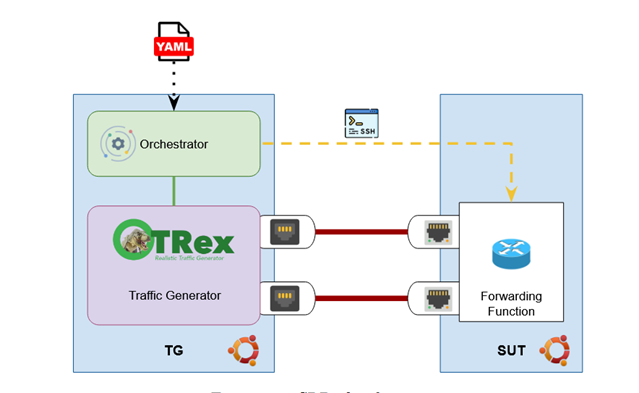

# PASTRAMI

**P**erformance **A**ssessment of **S**of**T**ware **R**outers **A**ddressing **M**easurement **I**naccuracy

## Introduction

Virtualized environments offer a flexible and scalable platform for evaluating network performance, but they can introduce significant variability that complicates accurate measurement. PASTRAMI is a methodology designed to assess the accuracy of performance measurements of software routers. In particular we address the accuracy of performance metrics such as the Partial Drop Rate at 0.5% (PDR@0.5%). While PDR@0.5% is a key metric to assess packet processing capabilities of a software router, its reliable evaluation depends on consistent router performance with minimal measurement variability. Our research reveals that different Linux versions exhibit distinct behaviors, with some demonstrating non-negligible packet loss even at low loads and high variability in loss measurements, rendering them unsuitable for accurate performance assessments. PASTRAMI proposes a systematic approach to differentiate between stable and unstable environments, offering practical guidance on selecting suitable configurations for robust networking performance evaluations in virtualized environments.
In addition to throughput consistency and packet loss, PASTRAMI also deals with latency and jitter as significant performance evaluation aspects. The accuracy in measuring latency is significant since minor fluctuations have a significant effect on application layer quality of service. Our methodology identifies the way kernel releases and virtualization layers introduce additional delays or timing fluctuations that must be treated with caution so as not to draw false inferences. By including latency-aware measurement, PASTRAMI offers a more precise and comprehensive assessment of software router performance
Architect:
 

The Pastrami in this repository has been made with the above architect, as you can see we have two nodes named TG as traffic generator and SUT as system under test.
You can use this repository to measure the performance of CPU and Latency. 
How to run?
For installing the requirements and preparing the environment, you should take some steps.
1-	Make a clone in both of the nodes with the branch of Rasool.
```bash
git clone -b rasool https://github.com/netgroup/pastrami.git

2-	Make the ssh key and copy it to the Sut as an authorized node.
ssh-keygen
ssh-copy-id -i or you can make it manually.
Test with ssh root@IP-OF-SUT, you should log in without password requirement.
3-	Run the file  setup_tg.sh, it automatically installs all the requirements and does the configuration.
Command: ./setup_tg.sh
4-	 After installation has successfully passed, run the trex_run_fin.sh
Command: ./trex_run_fin.sh
5-	We prepare a configuration yml file that you can change the test configuration as you need. You need to set at least the IP address of the SUT node in (IP_REMOTE). By default, we set CPU number 4 for the test.  Set it as you wish, depending on your servers. And you can choose the kernel that you want to test. The other setting is clear.
6-	Now everything is ready to make the test. You can run the file experiment-run-yaml.py and get the test of CPU performance.
Command: sudo python3 experiment-run-yaml.py
7-	As the test is completed, you can see the results in the file named (netrace_data).
8-	For take the latency test you should go to the directory named latency and, depending on the need, run each Python file with the command (sudo python3 FILE-NAME)
9-	The results will save on a SCV file.

