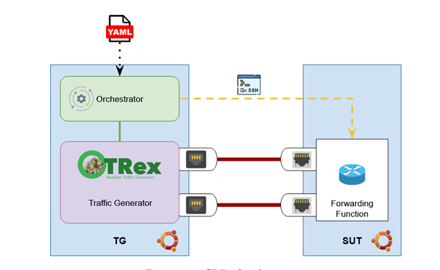

# PASTRAMI

**P**erformance **A**ssessment of **S**of**T**ware **R**outers **A**ddressing **M**easurement **I**naccuracy

## Introduction

Virtualized environments offer a flexible and scalable platform for evaluating network performance, but they can introduce significant variability that complicates accurate measurement. PASTRAMI is a methodology designed to assess the accuracy of performance measurements of software routers. In particular we address the accuracy of performance metrics such as the Partial Drop Rate at 0.5% (PDR@0.5%). While PDR@0.5% is a key metric to assess packet processing capabilities of a software router, its reliable evaluation depends on consistent router performance with minimal measurement variability. Our research reveals that different Linux versions exhibit distinct behaviors, with some demonstrating non-negligible packet loss even at low loads and high variability in loss measurements, rendering them unsuitable for accurate performance assessments. PASTRAMI proposes a systematic approach to differentiate between stable and unstable environments, offering practical guidance on selecting suitable configurations for robust networking performance evaluations in virtualized environments.
In addition to throughput consistency and packet loss, PASTRAMI also deals with latency and jitter as significant performance evaluation aspects. The accuracy in measuring latency is significant since minor fluctuations have a significant effect on application layer quality of service. Our methodology identifies the way kernel releases and virtualization layers introduce additional delays or timing fluctuations that must be treated with caution so as not to draw false inferences. By including latency-aware measurement, PASTRAMI offers a more precise and comprehensive assessment of software router performance
Architect:
 

The Pastrami in this repository has been made with the above architect, as you can see we have two nodes named TG as traffic generator and SUT as system under test.  
The testbed consisted of two nodes:  

  1. Traffic Generator (TG): Equipped with TRex, responsible for injecting and receiving
traffic. One NIC port transmits packets, the other receives them back after forwarding.

  2. System Under Test (SUT): Forwards packets from ingress to egress port. Configured
for various forwarding behaviors (IPv4, IPv6, L2, SRv6).

_________________________________________________________________________________________________________________________________________________________________
How to run:

1-	Make a clone in both of the nodes with the branch of Rasool, in both SUT and TG server.
```bash
git clone -b rasool https://github.com/netgroup/pastrami.git
```
2. Navigate to the /scripts directory and run the create_key.sh script using the command below.
This will generate an SSH key pair inside the sshkeys directory.
Copy the tg_to_sut.pub file and paste its contents into the /root/.ssh/authorized_keys file on the SUT node.
```bash
sudo ./create_key.sh
```
✅ Verifying SSH Connection

After copying the public key to the SUT, make sure the key and connection are working correctly by running the following command (replace SUT_IP with your SUT’s IP address):
```bash
sudo ssh -i /root/.ssh/id_rsa root@SUT IP 'echo OK && uname -a'
```
If everything is configured properly, you should see an output similar to this:
```bash
OK
Linux sut.test-final.superfluidity-pg0.wisc.cloudlab.us 5.15.0-151-generic #161-Ubuntu SMP Tue Jul 22 14:25:40 UTC 2025 x86_64 x86_64 x86_64 GNU/Linux
```

3. Navigate to the /scripts directory on the TG node and open the config.yml file using the command below.
Then, set the IPv4 address of the SUT node inside the configuration file.
```bash
sudo nano config.yml
```
🚀 Next Steps

Now that the primary setup is complete, you can proceed with running experiments:

To run CPU experiments and performance tests, navigate to the /scripts directory:
```bash 
cd /scripts
```
To run latency experiments, navigate to the /latency directory and follow the step-by-step instructions provided in the README.md file inside that folder
```bash
cd /latency
```
Make sure all configurations and IP addresses are correctly set in the config.yml file before starting any experiment.
