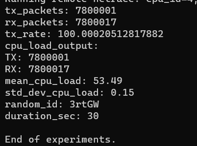

# PASTRAMI

**P**erformance **A**ssessment of **S**of**T**ware **R**outers **A**ddressing **M**easurement **I**naccuracy

## Introduction

Virtualized environments offer a flexible and scalable platform for evaluating network performance, but they can introduce significant variability that complicates accurate measurement. PASTRAMI is a methodology designed to assess the accuracy of performance measurements of software routers. In particular we address the accuracy of performance metrics such as the Partial Drop Rate at 0.5% (PDR@0.5%). While PDR@0.5% is a key metric to assess packet processing capabilities of a software router, its reliable evaluation depends on consistent router performance with minimal measurement variability. Our research reveals that different Linux versions exhibit distinct behaviors, with some demonstrating non-negligible packet loss even at low loads and high variability in loss measurements, rendering them unsuitable for accurate performance assessments. PASTRAMI proposes a systematic approach to differentiate between stable and unstable environments, offering practical guidance on selecting suitable configurations for robust networking performance evaluations in virtualized environments.
In addition to throughput consistency and packet loss, PASTRAMI also deals with latency and jitter as significant performance evaluation aspects. The accuracy in measuring latency is significant since minor fluctuations have a significant effect on application layer quality of service. Our methodology identifies the way kernel releases and virtualization layers introduce additional delays or timing fluctuations that must be treated with caution so as not to draw false inferences. By including latency-aware measurement, PASTRAMI offers a more precise and comprehensive assessment of software router performance
Architect:
 

The Pastrami in this repository has been made with the above architect, as you can see we have two nodes named TG as traffic generator and SUT as system under test.  
The testbed consisted of two nodes:  

  1. Traffic Generator (TG): Equipped with TRex, responsible for injecting and receiving
traffic. One NIC port transmits packets, the other receives them back after forwarding.

  2. System Under Test (SUT): Forwards packets from ingress to egress port. Configured
for various forwarding behaviors (IPv4, IPv6, L2, SRv6).

You can use this repository to measure the performance of CPU and Latency. 
How to run?
For installing the requirements and preparing the environment, you should take some steps.  

***All the requierment will be automatically install with runing the setup file on the nodes but for better understanding we list it here***
```bash
sudo apt install -y python3 python3-pip python3-venv

apt install -y python3-pip sysstat

pip3 install pyaml numpy paramiko
```

1-	Make a clone in both of the nodes with the branch of Rasool, in both SUT and TG server.
```bash
git clone -b rasool https://github.com/netgroup/pastrami.git
```


2-	Make the ssh key and copy it to the Sut as an authorized node. as we use Paramiko for ssh connections you should generate a key to be compatible with it:
```bash 
sudo ssh-keygen -t rsa -b 4096 -m PEM -f /root/.ssh/id_rsa -N ""
```
if you have password for login you can use the copy command: 
```bash
sudo ssh-copy-id -i /root/.ssh/id_rsa.pub root@”SUT IP ”
``` 
or if not, you should copy the public key in /root/.ssh/authorized_keys on SUT.
on TG run: 
```bash
sudo cat /root/.ssh/id_rsa.pub
```
select all the key and make a copy.
Go to the SUT and copy manually the key in authorized section :
```bash
sudo nano /root/.ssh/authorized_keys
 ```
paste it here at free space end of file and save it.
To make the test to be sure that key is correctly work run the command:
```bash
sudo ssh -i /root/.ssh/id_rsa root@SUT IP 'echo OK && uname -a'
```
you should see the OK and  linux kernel version and the descriptions.
For example:  

OK
Linux sut.test-final.superfluidity-pg0.wisc.cloudlab.us 5.15.0-151-generic #161-Ubuntu SMP Tue Jul 22 14:25:40 UTC 2025 x86_64 x86_64 x86_64 GNU/Linux

  

3-	Run the file  setup_tg.sh on TG and again do the same in SUT , it automatically installs all the requirements and does the configuration.
```bash
 sudo ./setup_tg.sh
```
on SUT:
```bash
sudo ./setup_sut.sh
```
***if the bash file did not run pay attention that they should have execution permission.***  

the permission will give to the files by runing:
```bash
sudo chmod +x "file name"
```
4-	 After installation has successfully passed, run the trex_run_fin.sh on the TG node.
```bash
sudo ./trex_run_fin.sh
```
5-	We prepare a configuration yml file that you can change the test configuration as you need. You need to set at least the IP address of the SUT node in (IP_REMOTE). By default, we set CPU number 4 for the test.  Set it as you wish, depending on your servers. And you can choose the kernel that you want to test. The other setting is clear.

6-	Now everything is ready to make the test. You can run the file experiment-run-yaml.py and get the test of CPU performance.
```bash
 sudo python3 experiment-run-yaml.py
```
7-	As the test is completed, you can see the results in the file named (netrace_data).
during the tests you should see on the screen the results such as :  

   
 
***The TX and RX should not be zero***  


8-	For take the latency test you should go to the directory named latency and open the file named run-latency,py and write the name of the file you need to test in the scripts part, depending on the need, run each Python file with the command:
```bash
sudo python3 run-latency.py
```
9-	The results will save on a SCV file.


